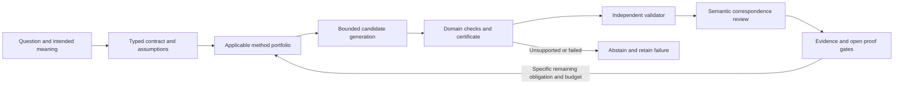

# Architecture and governance

Route: **one writer with an external architecture snapshot used for review**. The governing AxiomWeave router recommended centralized review for the coupled proof/configuration/publication state. A genuinely independent reviewer was not instantiated; that gate remains open. The read-only pasted Antigravity architecture is inspiration, not independent attestation.

Pipeline: question → typed contract → method portfolio → bounded candidate generation → domain checks → certificate → validator → evidence receipt → open gates. Semantic correspondence is a separate obligation throughout. Appropriate methods depend on the input representation and theorem quantifiers; applying every catalog method to every question is generally meaningless.

The 95 contracts are grouped in a finite seed ontology. Existing bounded tools cover exact polynomial grammar, Laurent cancellation, rational intervals, finite CNF, hereditary pruning over a frozen subset lattice, structured field comparison, chain complexes and product-ring pairings. Optional external backends add Arb zeta windows and spectral balls and PARI rank bounds. `execute_method` addresses the full catalog and abstains for absent adapters.

The server accepts JSON-RPC over stdio, restricts message size, validates top-level tool arguments, bounds nested inputs, and accepts no arbitrary Python, shell, Lean or GP candidate code. The optional PARI adapter executes a fixed program containing only validated integer coefficients, with a 30-second timeout. No MCP tool creates cloud resources, trades, sends messages or mutates global IDE settings.

All material assumptions and decisions in [receipts/governance.json](receipts/governance.json) include evidence, claim ceiling, falsifier, budget and stop rule. C0 describes proposed routing/checklists; C1 describes bounded runtime and exact mechanics. A finite computation, certificate format or assistant agreement does not establish independent adjudication, general theorem truth, or model-weight training.

Public receipts are selected to avoid private history and cloud identity. Content hashes establish file identity and change detection, not immutable public truth or independent review. External correctness assumptions, input domain and omitted proof gates must accompany results.

Loops: maximum three finite expansion rounds plus one final control sweep. Each round expands predetermined domains. Stop at cap, missing prerequisites, failure, or no new universal-proof gate. These loops do not implement an unlimited literature search, automated discovery of every method, or all-combination validation. The catalog audit checks 9,025 pairs of contracts; it does not execute those pairs as mathematical solvers.

Novelty and utility require separate preregistered held-out tasks, comparable search budgets, exhaustive/random baselines, independent certificate checkers, retained failure cases, and useful reductions in proof obligations. Local MCP profiles stay off except for the smallest task scope. Official SDK operation is distinct from live IDE discovery.

## What constitutes a solution system?

A useful system is a tuple: **problem representation, assumptions, generator, search policy, admissibility predicate, certificate, validator, semantic correspondence test, and stopping rule**. Apriori is primarily a search/enumeration policy. Hereditary pruning is a property needed to justify a class of pruning rules. The semantic correspondence gap is an obligation between representations and intended meaning. Treating all three as interchangeable solvers obscures their different roles.

Possible tuples form an unbounded space as representations, programs and theorem families vary. Enumerating programs does not decide which halt or solve a given problem; general truth and termination need not be decidable. Finite saturation therefore cannot ensure that every future useful method has been found. This infrastructure stores typed, extensible contracts and tests their supported compositions rather than claiming a universal complete solver.

The nine current families are formulation (8), deduction (10), search (16), algebra (11), analysis (13), geometry (6), optimization (8), empirical inference (12), and engineering/evaluation (11). Future additions need a concrete input domain, falsifier, backend, certificate and validation receipt.

